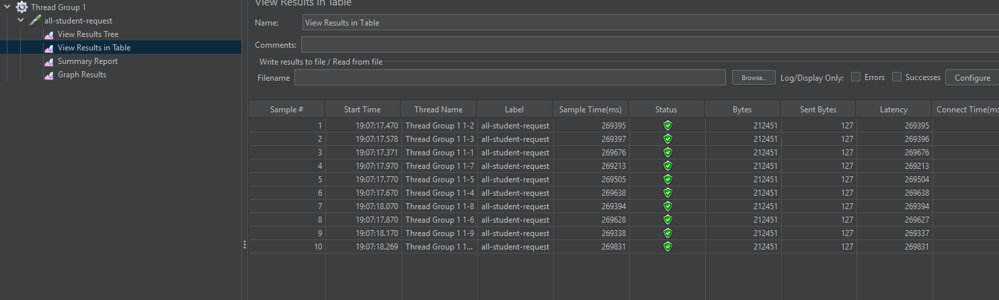
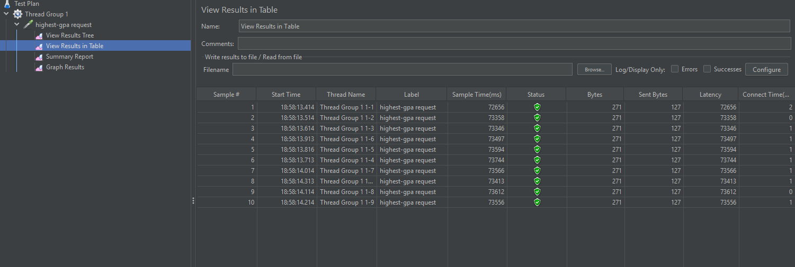
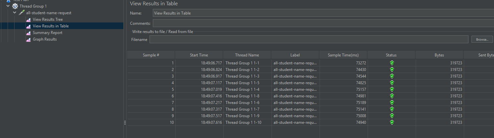
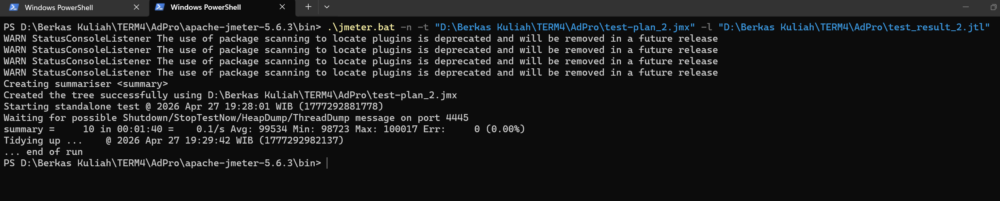
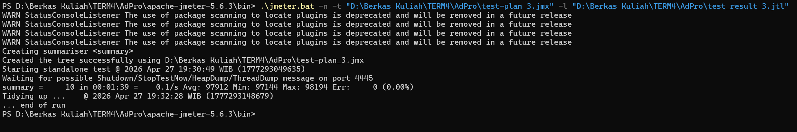

# 3 endpoints checks result

# 2 endpoints checks result via command line

## Optimization Checks

After implementing the changes, the most visible improvements were:

| Area | Before | After | Notes |
| --- | --- | --- | --- |
| `findStudentWithHighestGpa()` | Around `5000 ms` | Around `30-45 ms` | Improvement came after adding a database index on the `gpa` column. |
| `/all-student-name` processing | Around `5000 ms` | Around `1000 ms` | Improvement came from selecting only `name` in the query and replacing manual concatenation with `String.join(...)` on `List<String>`. |

These results show that the main bottlenecks were query cost and unnecessary string-processing overhead.

## Reflection

1. **Difference between JMeter and IntelliJ Profiler**  
   JMeter measures the application from the outside, similar to a user sending HTTP requests to the system. It helps observe response time, throughput, error rate, and how well an endpoint handles load.

   IntelliJ Profiler analyzes the application from the inside. It shows which methods consume the most CPU time, total execution time, or memory while the application is running.

2. **How profiling helps optimization**  
   Profiling shows the runtime behavior of the application. By identifying the methods that consume the most resources during a request, it becomes easier to target the real bottleneck and optimize the right part of the code.

3. **Effectiveness of the profiler**  
   Yes, the profiler was effective for identifying execution paths and resource usage inside the application. JMeter highlighted which endpoint was slow, while the profiler helped trace which service logic needed optimization.

4. **Challenges during profiling**  
   The first few runs were not very accurate, so I repeated the application run several times and observed it over a longer duration before drawing conclusions.

   Another challenge was distinguishing application code from framework code. Profiler output often includes many Spring and Java internal methods, so I focused mainly on my own packages, especially controllers and services.

5. **Main benefit of profiling**  
   The main benefit is that profiling helps identify the exact method causing the performance issue, which makes optimization more accurate and more efficient.

6. **Why JMeter and profiler results can differ**  
   JMeter measures external response time, including request handling and end-to-end latency.

   IntelliJ Profiler measures internal execution details such as CPU time and method-level behavior.

   Because of that, even if a method becomes much more efficient internally, JMeter results may not improve by the same amount due to database latency, response size, or overall system load.

7. **Optimization strategy used**  
   Most of the optimization work in the service layer focused on improving database queries.

   For `/all-student-name`, I also improved string handling by simplifying the concatenation logic and using `String.join(...)`.
